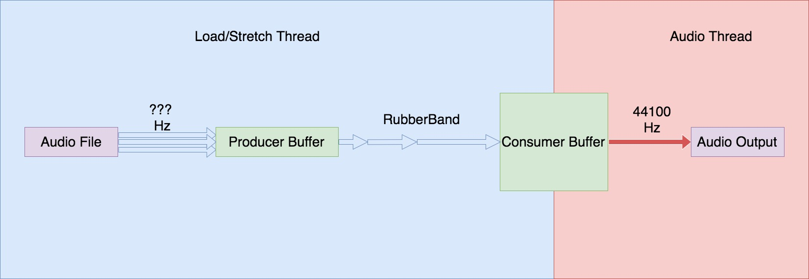
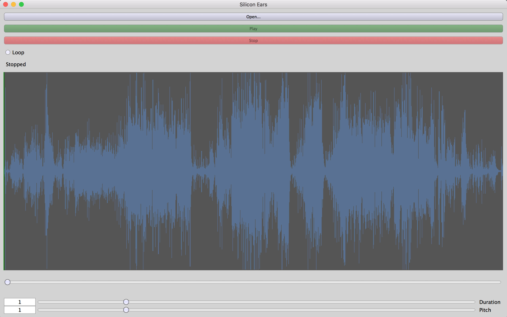

# Derek Zoolander's Silicon Ears For People Who Can't Music Good (And Who Wanna Learn To Do Other Stuff Good Too)

As musicians, we feel that the study of recordings and live performances
develops musical understanding and skills that cannot be obtained from the
study of scores. Transcription of existing musical performances develops the
relationship between musical concepts as they are taught, and a musician’s
“inner
ear.” There’s a wall for beginning musicians when they try to start
transcription, and classical aural-training exercises are both boring, and
insufficient. Writing down a monophonic piano line that the teacher played is
one thing,
picking out a note from a beebop solo with many other instruments in the mix is
entirely another. Existing transcription so ware is either
expensive [Transcribe!](Transcribe!) or hard to
use
([Sonic Visualizer](http://sonicvisualiser.org/), [Audacity](audacityteam.org)).

## What is it?

[Silicon Ears](https://github.com/MannySchneck/silicon-ears) provides an interface for the non-technical user to independently
manipulate the pitch and time-scale of an audio recording. The goal is to provide an
easy interface for selecting transpositions, and slowing recordings down for
close study, or accompanied practice.

## How does it work?
Silicon Ears was built on JUCE, a C++ toolkit, and RubberBand, a phase vocoder
implementation. The main work so far has been to develop buffering systems
capable of supporting real-time stretched and pitch-shifted playback.

The core of the system is a concurrent-access ring buffer that holds the
stretched audio data for consumption. The background thread loads and stretches
the data, pushing it into this buffer, while the audio thread pulls data from
it, the goal being to maintain the sample rate that the audio-thread requires
for glitch free playback regardless of the stretch-ratio being applied to the
file.

## How good is it?
The program needs to be at least.... THREE TIMES LESS GLITCHY. The buffering
system described above works. For a certain definition of works. It plays audio
and doesn't sound completely terrible. However, there is an issue with the
wrapping at the ring buffer, and at smaller buffer sizes, an audible pop can be
heard every time the . Low-level inspection of the system and the raw arrays
suggests that the code is handling the data correctly, and that there are no
off-by 1 errors in the stream. Since this is a real-time system, I suspect that
the issue is cache-related. When the ring-buffer cycles, it breaks the linear
memory access pattern, and until the cache catches up, there's a moment where
the audio-thread starves for data. Pre-fetching at the ringbuffer wrap-point
would solve this (or buffering the buffer).

Long story short. Real time is really hard. Interesting (read ear-destroying)
glitches will be heard if the system is run with other applications placing
noticeable CPU load on the operating system.

Currently, the system is incomplete. The final product will allow users to
select loops, and bookmark their selections for later reference, as well as
support simple annotation of the waveform for analysis of musical structure.

A long term goal, which may not be possible due to SDK and license restrictions, would be to provide integration with Spotify (or a similar streaming service).

## Source Repository:
[Silicon Ears](https://github.com/MannySchneck/silicon-ears)
